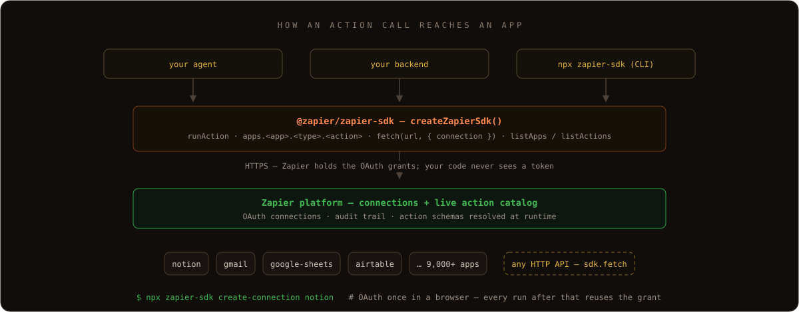

<div align="center">
  
</div>

Let your agent connect to anything. Zapier handles the keys.

Programmatic access to Zapier's full app ecosystem via [`@zapier/zapier-sdk`](https://www.npmjs.com/package/@zapier/zapier-sdk) on npm. Any API call, on behalf of a user.

This repo bundles the SDK's docs, verified examples, and installable agent skills.


<sub>Captured CLI output, replayed — not a mockup. The copyable commands are in <a href="#getting-started">Getting started</a> below; the capture provenance lives in <a href=".github/scripts/readme-art/transcript.mjs"><code>transcript.mjs</code></a>.</sub>

## Getting started

Prefer to let your AI coding assistant handle setup? [Install as a plugin instead](#install-with-your-favorite-ai-coding-assistant).

### 1. Install

```bash
npm install @zapier/zapier-sdk
npm install -D @zapier/zapier-sdk-cli @types/node typescript
```

### 2. Authenticate

Log in once. Your credentials get stored on your machine and picked up automatically the next time you call `createZapierSdk()`.

```bash
npx zapier-sdk login
npx zapier-sdk get-profile
```

### 3. Connect an app

Every action needs a *connection*: an OAuth grant Zapier holds for the app you're calling. Add one (or several) for whichever apps you want to try. Each `create-connection` command opens a browser for OAuth.

```bash
npx zapier-sdk list-connections
npx zapier-sdk create-connection notion
npx zapier-sdk create-connection gmail
npx zapier-sdk create-connection google-sheets
npx zapier-sdk create-connection airtable
```

Any of Zapier's 9,000+ apps works. Swap `notion` for the slug you need.

### 4. Fire an action

Once you have a connection, `run-action` calls any action from the CLI.

```bash
# Search Notion pages by title
npx zapier-sdk run-action notion search page_by_title \
  --inputs '{"title":"Meeting Notes","exact_match":"no"}'

# Search Gmail with the standard Gmail query syntax
npx zapier-sdk run-action gmail search message \
  --inputs '{"query":"from:receipts@stripe.com"}'

# Look up a Google Sheets row by column value
npx zapier-sdk run-action google-sheets search lookup_row \
  --inputs '{"spreadsheet":"<sheet-id>","worksheet":"<tab-id>","lookup_key":"Email","lookup_value":"jane@example.com"}'

# Find an Airtable record by field
npx zapier-sdk run-action airtable search findRecord \
  --inputs '{"applicationId":"<base-id>","tableName":"Leads","searchByField":"Email","searchByValue":"jane@example.com"}'
```

See more actions in [`examples/by-app/`](./examples/by-app). Full API reference at [docs.zapier.com/sdk/reference](https://docs.zapier.com/sdk/reference). Want to see more examples in this repo? [Open a PR](./CONTRIBUTING.md) — contributions welcome.

## Examples

The [`examples/`](./examples) directory is the heart of this repo — indexed three ways:

- **[`by-app/`](./examples/by-app)** — plain single-action SDK examples, one authenticated call.
- **[`by-domain/`](./examples/by-domain)** — curation-only READMEs mapping a domain (engineering, real estate, ...) to the examples that matter.
- **[`by-pattern/`](./examples/by-pattern)** — end-to-end automations by shape (notify-on-event, data-sync, lead-routing, scheduled-report).

## How it fits together

Your code calls one npm package; Zapier holds the OAuth grants and resolves action schemas at runtime, so your code never touches a token.



## Install with your favorite AI coding assistant

Drop every best practice for writing Zapier SDK code straight into your agent's context. Your agent picks up:

- **The `zapier-sdk` skill**: how to authenticate, discover apps and actions at runtime, run actions without inventing method names, and reach for the right escape hatch when there's no first-class action.
- **The `zapier-workflows` skill**: build, test, deploy, list, and modify durable workflows — code that runs on Zapier's infrastructure on a trigger, instead of in your own process.
- **The `zapier-sdk-explorer` subagent**: a read-only investigator that resolves exact app / action / field IDs against the live Zapier catalog before your agent writes a line of code.
- **The verified examples corpus**: every action key checked against `listActions` on the way in, so your agent has canonical, copy-paste-ready patterns to grep.

Result: fewer round trips to the docs, no more invented action keys, and workflows that work the first time.

### Claude Code

```
/plugin marketplace add zapier/marketplace
/plugin install sdk@zapier
```

### OpenAI Codex

```
codex plugin marketplace add zapier/marketplace
codex plugin add sdk@zapier
```

Or open the in-CLI picker with `/plugins` and toggle the SDK plugin on.

### GitHub Copilot CLI

```
copilot plugin marketplace add zapier/marketplace
copilot plugin install sdk@zapier
```

### Cursor and other assistants

The [`zapier-sdk`](./skills/zapier-sdk/) and [`zapier-workflows`](./skills/zapier-workflows/) skills conform to [agentskills.io](https://agentskills.io) so any conformant runtime can load them directly. For tools without native agentskills.io support, clone the repo and reference the relevant `SKILL.md` from your assistant's rules or instructions file (`.cursorrules`, `AGENTS.md`, `.github/copilot-instructions.md`, etc.):

```
git clone https://github.com/zapier/sdk.git
```

## Learn more

- **[zapier.com/sdk](https://zapier.com/sdk)** — product page, pricing, and what the SDK unlocks.
- **[docs.zapier.com/sdk](https://docs.zapier.com/sdk)** — SDK guides and tutorials.
- **[docs.zapier.com/sdk/reference](https://docs.zapier.com/sdk/reference)** — full method reference.
- **[docs.zapier.com/sdk/cli-reference](https://docs.zapier.com/sdk/cli-reference)** — CLI reference for `zapier-sdk`.
- **[`skills/zapier-sdk/references/cli-commands.md`](./skills/zapier-sdk/references/cli-commands.md)** — full CLI command inventory in-repo, generated from `zapier-sdk --help`.
- **[`skills/zapier-workflows/`](./skills/zapier-workflows/)** — the durable workflows skill: build, test, deploy, list, and modify code that runs on Zapier's infrastructure.
- **[`@zapier/zapier-sdk`](https://www.npmjs.com/package/@zapier/zapier-sdk)** — runtime SDK on npm.
- **[`@zapier/zapier-sdk-cli`](https://www.npmjs.com/package/@zapier/zapier-sdk-cli)** — CLI companion on npm.
- **[Zapier MCP](https://github.com/zapier/zapier-mcp)** — the MCP-server alternative for tool-calling from Cursor, Claude Desktop, or Codex.
- **[`llms.txt`](./llms.txt)** — this repo's LLM-friendly index of the skill, examples, and agents.
- **[docs.zapier.com/llms.txt](https://docs.zapier.com/llms.txt)** — LLM-friendly index of the docs.
- **[docs.zapier.com](https://docs.zapier.com)** — everything else Zapier.

## Contributing

PRs and feature requests welcome. Start with [CONTRIBUTING.md](./CONTRIBUTING.md). For SDK security issues, email **security@zapier.com** — don't open a public issue.

## Trademarks

Product and company names used in these examples are trademarks of their respective owners and are used only to identify the service each example integrates with. These examples are not affiliated with, endorsed by, or sponsored by those companies.

## License

MIT (see [LICENSE](./LICENSE)) — covers the code only. Using the Zapier service and APIs through this SDK is governed separately by the [Zapier Terms of Service](https://zapier.com/legal/terms-of-service) or your other agreement with Zapier for use of the Zapier service.
