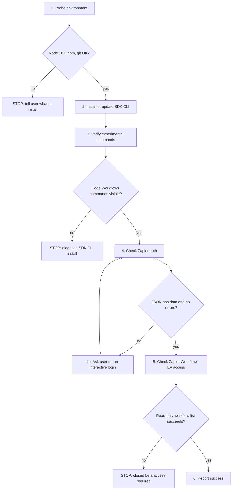

# Workflows Setup

Read this when the SDK CLI isn't installed, isn't authenticated, or Zapier Workflows EA access hasn't been confirmed. Imperative recipe — each step gates the next. Do not skip a step that failed.

This is the public-first EA path. It uses the Zapier SDK CLI and does not install the legacy `@zapier/zapier-sdk-code-substrate` package.

## Flow



## What this installs

- `@zapier/zapier-sdk-cli@latest` — public npm package that provides `zapier-sdk`, `zapier-sdk-cli`, and `zapier-sdk-experimental`. Installed globally.

What this does not install:

- `@zapier/zapier-sdk-code-substrate` — old private CLI path. Do not install it for EA.
- `@zapier/zapier-durable` globally. [`build-and-deploy.md`](build-and-deploy.md) installs or pins it inside individual workflow projects when needed.

## Step 1: Probe environment

Run each check. If any fails, stop and tell the user how to fix it.

```bash
node --version
npm --version
git --version
```

Expected output:

```bash
v18.0.0   # or higher
10.x.x    # npm version; any current version is fine
git version 2.x.x
```

Requirements:

| Tool | Minimum version | Install if missing |
|---|---|---|
| Node | 18 | `brew install node` or use nvm |
| npm | any current version | bundled with Node |
| git | any | usually preinstalled on macOS; otherwise `brew install git` |

If Node or npm is missing, explain that Node includes npm and the user needs a normal Node install before continuing. For macOS users, suggest either the Node LTS installer from `nodejs.org`, Homebrew (`brew install node`), or nvm if they already use it. Do not continue until `node --version` and `npm --version` work.

If git is missing, explain that git is needed to fetch things like the verified examples corpus. For macOS users, suggest installing Apple Command Line Tools or Homebrew git. Do not continue until `git --version` works.

## Step 2: Install or update the Zapier SDK CLI

Check for an existing binary and the latest published CLI version:

```bash
which zapier-sdk
zapier-sdk --version
npm view @zapier/zapier-sdk-cli version
```

If `zapier-sdk` is missing, install the CLI globally:

```bash
npm install -g @zapier/zapier-sdk-cli@latest
```

If `zapier-sdk` already exists, compare the installed version from `zapier-sdk --version` with the latest version from `npm view @zapier/zapier-sdk-cli version`. If they differ, update the CLI:

```bash
npm install -g @zapier/zapier-sdk-cli@latest
```

After updating, rerun:

```bash
zapier-sdk --version
npm view @zapier/zapier-sdk-cli version
```

Continue only when the installed CLI version matches the latest published `@zapier/zapier-sdk-cli` version.

Verify the binary is on PATH:

```bash
which zapier-sdk
zapier-sdk --version
```

If global npm installs fail because of permissions, tell the user to fix their Node/npm setup before retrying. Prefer a user-owned Node install through nvm or Homebrew over `sudo npm install -g`.

## Step 3: Verify Code Workflows experimental commands

```bash
zapier-sdk --experimental --help
zapier-sdk --experimental create-workflow --help
zapier-sdk --experimental publish-workflow-version --help
zapier-sdk --experimental run-durable --help
zapier-sdk --experimental list-triggers --help
zapier-sdk --experimental get-workflow-run --help
zapier-sdk --experimental trigger-workflow --help
```

Expected output includes the Code Workflows command group, including commands such as:

```text
create-workflow
list-workflows
run-durable
publish-workflow-version
list-workflow-runs
get-workflow-run
```

The command-specific help must expose the flags the rest of this skill depends on:

- `create-workflow --help` includes `--private`.
- `publish-workflow-version --help` includes `--connections`, `--app_versions`, and `--trigger`.
- `run-durable --help` includes `--connections` and `--private`.
- `list-triggers --help` succeeds.
- `get-workflow-run --help` succeeds.
- `trigger-workflow --help` includes `--input`.

The equivalent binary may also work:

```bash
zapier-sdk-experimental --help
```

If neither form exposes Code Workflows commands, stop and diagnose the SDK CLI install. Do not fall back to `@zapier/zapier-sdk-code-substrate`.

If `zapier-sdk` exists but the Code Workflows command group or required command-specific flags are missing, the user likely has an older SDK CLI. Run:

```bash
npm install -g @zapier/zapier-sdk-cli@latest
zapier-sdk --experimental --help
zapier-sdk --experimental publish-workflow-version --help
```

Retry the command-specific help checks once after updating. Proceed only after the Code Workflows command group and required flags are visible. If the required flags are still missing after updating, stop and report the installed CLI version and latest npm version; do not attempt to build or deploy a workflow that the installed CLI can't support.

## Step 4: Authenticate to Zapier

Check auth state first:

```bash
zapier-sdk get-profile --json
```

Treat auth as successful only if the JSON has a non-null `data` object with an email and the `errors` array is empty. Do not rely on exit code alone; some SDK CLI auth failures return exit code 0 with errors in the JSON body.

Expected successful output includes the user's email:

```json
{
  "data": {
    "email": "user@example.com"
  },
  "errors": []
}
```

If `data` is null, `errors` is non-empty, or the error message says authentication is required, stop and ask the user to run the interactive login command in a real terminal:

```bash
zapier-sdk login
```

This opens a browser. The CLI error text may suggest `npx zapier-sdk login`, but after the global install above the preferred command is `zapier-sdk login`. Do not run browser login inside a non-interactive shell or background process unless the user explicitly asks you to manage the interactive login. After the user finishes login, rerun `zapier-sdk get-profile --json` and inspect the JSON again.

For Zapier employees, the normal path is to log in with their Zapier work account. For external-user testing, use the account that has been allowlisted for Zapier Workflows EA.

Do not ask the user for a Zapier password, API key, npm token, or copied auth token. Authentication should happen through the browser-based `zapier-sdk login` flow unless the user explicitly says they are using client credentials for automation.

If the user wants non-interactive auth for automation, note that the CLI error message may mention `ZAPIER_CREDENTIALS` or client credential environment variables. For this EA install path, prefer browser login unless the user already has client credentials.

## Step 5: Check Zapier Workflows EA access

After SDK profile auth succeeds, confirm the authenticated account has Zapier Workflows EA access with a read-only Code Workflows call:

```bash
zapier-sdk --experimental list-workflows --json
```

Expected output is JSON containing workflow data or an empty list, with no errors. This command should not create or modify cloud state.

Treat the access check as successful only if the JSON has workflow data or an empty workflow list and `errors` is empty. Do not rely on exit code alone; this command may return exit code 0 while the JSON body contains errors.

If the response says authentication is required, return to Step 4 and diagnose SDK auth.

If the response includes any of the following, treat it as a Zapier Workflows EA access failure and stop:

- `None of the security schemes (userJwt) successfully authenticated this request`
- `allowlist`, `not allowlisted`, or `not whitelisted`
- `forbidden`, `permission`, `unauthorized`, or `access denied`

When EA access fails, tell the user:

```text
You're logged in to Zapier as <email>, and the Zapier SDK CLI is installed, but this account does not currently have Zapier Workflows EA access.

Zapier Workflows is currently only available to members of our closed beta.

To request access, fill out the beta sign-up form:

https://next-gen-zaps.zapier.app/

Submitting the form does not grant access immediately. The Zapier team will review your request and let you know once access has been granted.

After your account is allowlisted, retry this setup. Reinstalling Node, npm, git, or the SDK CLI will not fix this access check.
```

Use the email from `zapier-sdk get-profile --json` in place of `<email>`.

## Step 6: Report success

Tell the user:

- Zapier SDK CLI is installed and on PATH, confirmed via `which zapier-sdk`.
- Code Workflows experimental commands are available.
- The authenticated Zapier account email from `zapier-sdk get-profile --json`.
- Zapier Workflows EA access was confirmed with a read-only workflow listing.
- This confirms SDK CLI install, login, and Zapier Workflows EA access. It does not yet prove that building, publishing, triggering, or running a full workflow works.

Next steps for the user:

- Configure app connections at https://zapier.com/app/assets/connections before attempting to build workflows.
- Ask the agent to create a workflow, for example: "Create a Zapier workflow that takes a manual input and sends a Slack message." See [`build-and-deploy.md`](build-and-deploy.md).

## Troubleshooting

| Symptom | Likely cause | Fix |
|---|---|---|
| `node --version` prints less than `v18` | Old Node | `brew upgrade node` or use nvm to install a current LTS |
| `npm install -g` fails with permissions errors | Global npm prefix is not user-writable | Use nvm or Homebrew Node; avoid `sudo npm install -g` unless the user explicitly accepts that system-level change |
| `zapier-sdk --experimental --help` lacks Code Workflows commands | Old CLI or wrong package installed | Install `@zapier/zapier-sdk-cli@latest`, then rerun `zapier-sdk --version` and the help command |
| `zapier-sdk get-profile` says not logged in | User has not authenticated the CLI | Run `zapier-sdk login` in an interactive terminal, then retry |
| `get-profile` succeeds but `list-workflows` returns an access, permission, allowlist, or JWT/security-scheme error | The Zapier account is authenticated but does not have Zapier Workflows EA access | Stop. Tell the user Zapier Workflows is currently only available to members of our closed beta, include the authenticated email, and ask them to retry after allowlisting |
| `zapier-sdk login` does not open a browser | No default browser configured, or remote/SSH session | Try `zapier-sdk login --no-browser` if supported by the installed CLI, or run from a local terminal |
| `zapier-sdk login` hangs in a non-interactive shell | `login` is browser-interactive; cannot run unattended | Ask the user to run it manually in an actual terminal |
